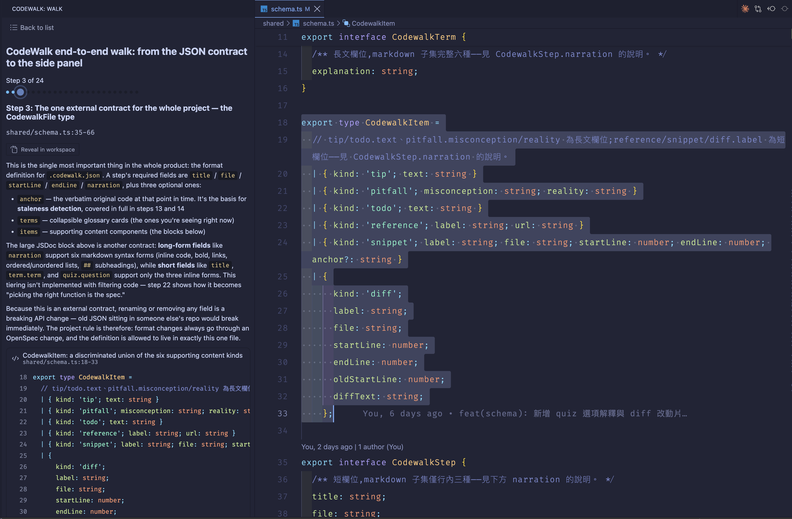

# CodeWalk

[](LICENSE)

English | [繁體中文](README.zh-TW.md)

> **Note:** The extension UI follows your VS Code display language (Traditional Chinese or English). Walk content (narration, quiz questions, etc.) is written by each walk's author and is shown as-is, unaffected by this setting.

The fastest way to actually understand someone else's code is to have a mentor sit next to you and walk you through it. CodeWalk brings that experience into the VS Code side panel.

CodeWalk reads a walkthrough file from your repo and guides you through it step by step: jumping to and highlighting the right lines, adding narration and glossary terms, and finishing with a quiz to check you actually understood it.

Useful for onboarding, picking up an unfamiliar module, sanity-checking a pile of AI-generated files, or getting a reviewer up to speed on a large diff before they review it.



## Quick Start

**1. Install**

Search for `CodeWalk` in the VS Code Extensions panel. After installing, a path icon appears in the Activity Bar.

**2. Prepare a walk**

Create a `.codewalk/` folder at your repo root and add a `*.codewalk.json` file ([format below](#codewalkjson-format)).

Don't want to write JSON by hand? [**Authoring walks**](docs/authoring-walks.md) has a prompt you can hand to any AI assistant — it covers three scopes: the whole codebase, the current git diff, or an area you name.

> CodeWalk is a player only — **it does not generate walks for you**. Write the file however you like: by hand, with an AI, or with any tool — as long as it matches the format.

**3. Start walking**

Click the path icon in the Activity Bar, or run the `CodeWalk: Open Walk` command, then pick a walk to begin.

| Key | Action |
| --- | --- |
| `→` / `↓` | Next step |
| `←` / `↑` | Previous step |
| `Home` | Reveal this step's code location |
| `Esc` | Back to walk list |

Keyboard shortcuts only work while the CodeWalk panel has focus — click anywhere in the panel to focus it.

## Features

- **Step-by-step walkthrough** — each step automatically opens the file, selects, and scrolls to the right line range. Focus stays on the panel, so your hands never leave the arrow keys
- **Glossary terms** — authors can annotate any step with terms; click to expand the explanation without cluttering the layout
- **Six kinds of supporting content** — tips, common misconceptions, todos, external references, code snippets, and diffs. Details in [Six Kinds of Supporting Content](#six-kinds-of-supporting-content) below
- **Syntax highlighting matches your theme** — powered by Shiki, colors come straight from your current VS Code theme. Supports 23 languages — see [Supported Languages](#supported-languages) below
- **Quiz mode** — take a quiz after finishing the walk to check whether you actually understood it. Every option explains why it's right or wrong, and a failing score suggests rereading the walk or retaking the quiz
- **Staleness detection** — a walk describes the code as it was at some point in time, and as the project keeps moving, it will eventually drift out of sync. CodeWalk checks each step: if the code merely shifted, it follows along automatically; if the content actually changed, it flags the step as stale and includes a one-click-copy way to regenerate the walk
- **Resume where you left off** — close and reopen VS Code, and the walk list still shows your last position

## `.codewalk.json` format

Type definitions live in [`shared/schema.ts`](shared/schema.ts). Minimal example:

```json
{
  "title": "Example walk",
  "ref": "<pinned commit sha>",
  "steps": [
    {
      "title": "Entry point",
      "file": "src/index.ts",
      "startLine": 1,
      "endLine": 1,
      "narration": "This is where the program starts.",
      "terms": [{ "term": "entry point", "explanation": "Where the program begins executing" }]
    }
  ],
  "quiz": [
    {
      "question": "...",
      "options": ["A", "B"],
      "correctIndex": 0,
      "optionExplanations": ["Why A is wrong", "Why B is right"]
    }
  ]
}
```

### Key fields

| Field | Description |
| --- | --- |
| `ref` | The commit sha the walk was generated against |
| `steps[].anchor` | Optional but **strongly recommended**: the verbatim original code at those lines. Without it, staleness detection isn't possible — CodeWalk can only fall back to a rough comparison against `ref` |
| `quiz` | At least 1 question. Each can include `optionExplanations`, which must be the same length as `options` |
| `passThreshold` | Number of correct answers needed to pass. Defaults to a simple majority of the question count (e.g. 5 questions defaults to a pass threshold of 3) |
| `regenerateHint` | How to regenerate this walk. When staleness is detected, the panel shows a copy button for it |
| `steps[].items` | The step's array of supporting content items — see [Six Kinds of Supporting Content](#six-kinds-of-supporting-content) below |

### Six kinds of supporting content

Each element of the `steps[].items` array is distinguished by its `kind` field, and a single step can freely mix multiple kinds:

| kind | Name | Description |
| --- | --- | --- |
| `tip` | Tip | A block of supplementary text — useful for extra context or suggestions |
| `pitfall` | Common misconception | A "misconception" and "reality" pair that calls out a common misreading of the code |
| `todo` | Todo | Reminds the reader of a follow-up action, e.g. "remember to add a matching test" |
| `reference` | External reference | A label + URL linking out to external docs or resources |
| `snippet` | Code snippet | Quotes another piece of code (the file and line range can differ from the step's main range), with the same syntax highlighting and staleness detection |
| `diff` | Diff | Shows a before/after diff for a piece of code |

### Supported languages

Syntax highlighting for `snippet` and `diff` is determined by file extension. Currently supported (23 languages):

- TypeScript
- JavaScript
- JSON
- Python
- Go
- Rust
- Java
- Kotlin
- Groovy
- Scala
- Dart
- Swift
- C#
- C
- C++
- PHP
- Ruby
- SQL
- CSS
- HTML
- Markdown
- Bash
- YAML

For extensions outside this list, CodeWalk shows the content as plain text rather than guessing a language.

### Markdown support

Narration-style fields (like `narration`) accept a **closed subset of markdown** — to keep walks readable without ever letting formatting overshadow the code itself. Six syntax forms are supported:

- **Inline code**: `` `code` ``
- **Bold**: `**text**`
- **Links**: `[text](https://...)` — only http/https take effect; other URLs are shown as literal text and aren't clickable
- **Unordered lists**: `- item` (nested indentation supported)
- **Ordered lists**: `1. item`
- **Level-2 subheadings**: `## Heading` (depth 2 only; `#` and below `###` aren't supported)

Anything else (tables, images, blockquotes, code blocks, headings other than `#`/`###` and below, raw HTML, etc.) is shown **as literal plain text** rather than breaking the walk. Short fields like titles, options, and term names only support the first three forms (inline code, bold, links) — lists and subheadings don't take effect there either.

Which fields belong to which tier is documented in the JSDoc for each field in [`shared/schema.ts`](shared/schema.ts).

## Commands and shortcuts

The arrow keys, `Home`, and `Esc` inside the panel are handled by the webview itself, **not VS Code keybindings** — you won't find them in `keybindings.json`, and they don't need a `when` clause; they just work while the panel has focus.

The four commands below are real VS Code commands — searchable in the command palette and bindable to your own shortcuts:

| Command ID | Title | Purpose |
| --- | --- | --- |
| `codewalk.openWalk` | CodeWalk: Open Walk | Open (or focus) the side panel |
| `codewalk.nextStep` | CodeWalk: Next Step | Advance one step, even without panel focus |
| `codewalk.prevStep` | CodeWalk: Previous Step | Go back one step, even without panel focus |
| `codewalk.revealCurrentStep` | CodeWalk: Reveal Current Step | Jump back to the current step's code location |

`nextStep` / `prevStep` exist for when you're mid-edit in the editor and want to move to the next step without moving focus back to the panel. Bind them to a shortcut and go.

In `keybindings.json`:

```json
{ "key": "ctrl+alt+right", "command": "codewalk.nextStep" },
{ "key": "ctrl+alt+left",  "command": "codewalk.prevStep" }
```

CodeWalk currently has no settings (`contributes.configuration` is empty) — colors follow your editor theme, and everything else is driven by the walk file itself.

## FAQ

**The panel says "No walks found"**
Make sure the workspace root has a `.codewalk/` directory, and that the files inside end in `.codewalk.json`.

**A "line numbers may have drifted" warning appears**
The current HEAD differs from the walk's pinned `ref`. If the walk includes `anchor`, CodeWalk falls back to a more accurate step-by-step comparison instead, and this warning won't appear.

**A step is marked "no longer matches the current code"**
That code genuinely changed. The panel shows the content as it was when generated so you can compare, with a button to open the current file. When this happens, regenerate the walk rather than manually fixing line numbers — a walk is meant to be disposable; let it be regenerated to match the latest code instead of patching it by hand.

**A snippet has no syntax highlighting**
The file's extension isn't among the 23 supported languages.

## Development

```bash
pnpm install
pnpm watch        # compile in watch mode
pnpm test         # Vitest unit tests
pnpm typecheck    # tsc --noEmit
pnpm format       # Prettier, whole project
pnpm package      # bundle into codewalk.vsix
```

Press `F5` in VS Code to launch the Extension Development Host for debugging.

Installing the VSIX locally:

```bash
pnpm package
code --install-extension codewalk.vsix
```

## About this project

CodeWalk is currently maintained by one person, not a commercial product.

**Reporting issues** — [issues](https://github.com/properworkstudio/codewalk/issues) are welcome. I'll do my best to address them, but can't promise a response time.

**Contributing** — please [open an issue](https://github.com/properworkstudio/codewalk/issues/new) to discuss direction before sending a PR. This repo manages its behavior spec with [OpenSpec](https://github.com/Fission-AI/OpenSpec); changes that haven't been discussed first are likely to conflict with the existing spec and be hard to merge.

**Support** — if CodeWalk saved you some time, you can [buy me a coffee](https://ko-fi.com/properworkstudio). Entirely optional, and it doesn't buy priority support — the note above still applies.

## License

[MIT](LICENSE)
