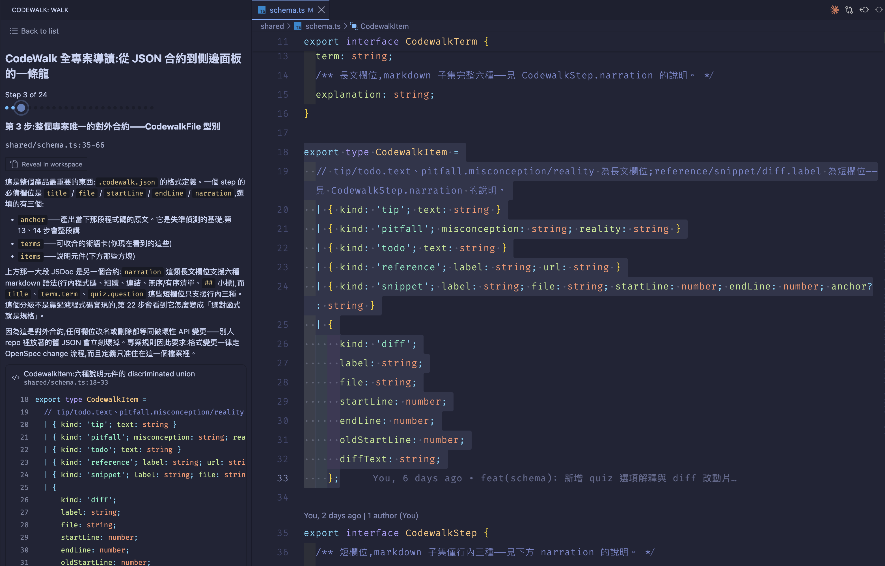

# CodeWalk

[](LICENSE)

[English](README.md) | 繁體中文

> **附註:** 擴充套件介面會跟隨 VS Code 的顯示語言（中文或英文）。導讀內容（敘述、quiz 題目等）由各份導讀的作者撰寫，原樣呈現，不受此設定影響。

想要快速讀懂一份程式碼，最快的方式就是有個小老師坐在旁邊邊指邊講。CodeWalk 把那個過程搬進 VS Code 側邊欄。

CodeWalk 會讀 repo 裡的導讀檔，一步一步帶著走：自動跳到對應的行號並 highlight、附上敘述和術語解釋，走完還能用 quiz 檢查自己有沒有真的看懂。

新人上手、接手不熟的模組、AI寫了一大堆檔案、送PR時讓 reviewer 先摸清一份大 diff——這些場合都用得上。



## 快速開始

**1. 安裝**

在 VS Code 的 Extensions 面板搜尋 `CodeWalk`。裝完左側活動列會多一個路徑圖示。

**2. 準備一份導讀**

在 repo 根目錄開一個 `.codewalk/` 資料夾，放進 `*.codewalk.json`（[格式見下方](#codewalkjson-格式)）。

> CodeWalk 目前只播放，**不會幫你產生導讀**。檔案要自己來：手寫、請 AI 寫、用任何工具產都行，只要符合格式就可以使用。

**3. 開始走**

點活動列的路徑圖示，或執行指令 `CodeWalk: 開啟導讀`，選一份就可以開始了。

| 按鍵      | 動作                   |
| --------- | ---------------------- |
| `→` / `↓` | 下一步                 |
| `←` / `↑` | 上一步                 |
| `Home`    | 回到這一步的程式碼位置 |
| `Esc`     | 回導讀列表             |

快捷鍵要 CodeWalk 面板有焦點的狀態才會生效，點一下 CodeWalk 面板任何地方就有了。

## 功能

- **逐步走讀**——每一步自動開檔、選取、捲到對應的行號範圍。焦點會留在面板上，所以你的手不用離開方向鍵
- **術語卡**——作者可以幫每一步標註術語，點一下展開解釋，不佔版面
- **六種說明元件**——提示、常見誤解、待辦、外部連結、程式碼片段、差異比對，細節見下方[「六種說明元件」](#六種說明元件)
- **語法highlight跟著你的主題走**——用 Shiki，配色直接取自你當下的 VS Code 主題。支援 23 種語言，清單見下方[「支援語言」](#支援語言)
- **Quiz 自測**——走完導讀可以接著作 Quiz 檢視自己是否有真的理解。每個選項都寫了為什麼對、為什麼錯，沒過會建議你重讀一遍或重做一遍 Quiz
- **失準偵測**——導讀寫的是某個時間點的程式碼，隨著專案持續進行，遲早可能會對不上。CodeWalk 會逐步核對：程式碼只是位移就自動跟上新行號，內容真的改了才標示失準，並附上重新產生本導讀的方式，一鍵複製
- **記住讀到哪**——關掉 VS Code 再開，列表上還能接續上次的進度

## `.codewalk.json` 格式

型別定義在 [`shared/schema.ts`](shared/schema.ts)。最小範例:

```json
{
  "title": "範例導讀",
  "ref": "<釘住的 commit sha>",
  "steps": [
    {
      "title": "入口檔案",
      "file": "src/index.ts",
      "startLine": 1,
      "endLine": 1,
      "narration": "這是程式的入口點。",
      "terms": [{ "term": "entry point", "explanation": "程式開始執行的地方" }]
    }
  ],
  "quiz": [
    {
      "question": "...",
      "options": ["A", "B"],
      "correctIndex": 0,
      "optionExplanations": ["為什麼 A 錯", "為什麼 B 對"]
    }
  ]
}
```

### 主要欄位

| 欄位             | 說明                                                                                                                  |
| ---------------- | --------------------------------------------------------------------------------------------------------------------- |
| `ref`            | 產出這份導讀時的 commit sha                                                                                           |
| `steps[].anchor` | 選填，但**強烈建議填寫**：產出當下那幾行的程式碼原文。有了這個才有辦法做「失準偵測」，沒有的話就只能靠 `ref` 粗略比對 |
| `quiz`           | 至少 1 題。每題可以填 `optionExplanations`，長度要跟 `options` 一樣                                                   |
| `passThreshold`  | 過關題數，不填就是題數的簡單多數(e.g. 5 題預設過關題數為 3 題)                                                        |
| `regenerateHint` | 重新產生這份導讀的方式。偵測到失準時，面板會給一個複製按鈕                                                            |
| `steps[].items`  | 該步驟的補充說明元件陣列，見下方[「六種說明元件」](#六種說明元件) |

### 六種說明元件

`steps[].items` 陣列的每個元素用 `kind` 欄位區分，同一步驟內可自由交錯排列多個:

| kind        | 名稱       | 說明                                                                                      |
| ----------- | ---------- | ----------------------------------------------------------------------------------------- |
| `tip`       | 提示       | 一段補充說明文字，適合放輔助資訊或延伸建議                                                |
| `pitfall`   | 常見誤解   | 「誤解」與「其實」成對呈現，點出讀者對這段程式碼常見的認知落差                            |
| `todo`      | 待辦       | 提醒讀者接下來該做的事，例如「記得補上對應測試」                                          |
| `reference` | 外部連結   | 標籤 + URL，連到外部文件或資源                                                            |
| `snippet`   | 程式碼片段 | 額外引用另一段程式碼（檔案與行號可與該步驟主要顯示的範圍不同）,同樣套用語法高亮與失準偵測 |
| `diff`      | 差異比對   | 顯示某段程式碼異動前後的差異                                                              |

### 支援語言

`snippet` 與 `diff` 的程式碼高亮依檔案副檔名判定，目前支援 23 種語言:

- TypeScript
- JavaScript
- JSON
- Python
- Go
- Rust
- Java
- Kotlin
- Groovy
- Scala
- Dart
- Swift
- C#
- C
- C++
- PHP
- Ruby
- SQL
- CSS
- HTML
- Markdown
- Bash
- YAML

副檔名不在清單內時，CodeWalk 會原樣顯示純文字，暫不上色。

### Markdown 支援

`narration` 這類敘述欄位為避免整體導讀變得太過華麗，掩蓋了導讀程式碼的功能，因此只支援一組**封閉的 markdown 子集**，共六種語法：

- **行內程式碼**：`` `code` ``
- **粗體**：`**text**`
- **連結**：`[文字](https://...)`——僅 http/https 生效，其餘網址原樣顯示、不可點擊
- **無序清單**：`- 項目`（支援縮排巢狀）
- **有序清單**：`1. 項目`
- **二級小標**：`## 標題`（僅 depth 2；`#`、`###` 以下不支援）

其他語法（e.g. 表格、圖片、引用區塊、程式碼區塊、`#` 和 `###` 以下的標題、原始 HTML 等）一律**原樣顯示成純文字**，不會讓整份導讀讀不出來。標題、選項、術語名這類短欄位只支援前三種（行內程式碼、粗體、連結），清單與小標也同樣不生效。

哪個欄位屬於哪一級，[`shared/schema.ts`](shared/schema.ts) 各欄位的 JSDoc 有寫。

## 指令與快捷鍵

面板裡的方向鍵、`Home`、`Esc` 是 webview 自己監聽的，**不是 VS Code 的 keybinding**，在 `keybindings.json` 裡找不到，也不需要設定 when 條件——只要面板有焦點就會生效。

下面這四個是真正的 VS Code 指令，可以在指令面板搜尋，也可以自己綁快捷鍵:

| 指令 ID                      | 顯示名稱                   | 用途                           |
| ---------------------------- | -------------------------- | ------------------------------ |
| `codewalk.openWalk`          | CodeWalk: 開啟導讀         | 開啟（或聚焦）側邊面板         |
| `codewalk.nextStep`          | CodeWalk: 下一步           | 前進一步，面板沒有焦點時也有效 |
| `codewalk.prevStep`          | CodeWalk: 上一步           | 後退一步，面板沒有焦點時也有效 |
| `codewalk.revealCurrentStep` | CodeWalk: 回到本步專案位置 | 重新跳到目前這一步的程式碼     |

`nextStep` / `prevStep` 存在的理由是：在編輯器裡改東西改到一半，想往下走一步又不想把焦點移回面板。綁個快捷鍵就能直接走。

在 `keybindings.json` 裡這樣綁:

```json
{ "key": "ctrl+alt+right", "command": "codewalk.nextStep" },
{ "key": "ctrl+alt+left",  "command": "codewalk.prevStep" }
```

CodeWalk 目前沒有任何設定項（`contributes.configuration` 是空的）——配色跟著你的編輯器主題走，其餘行為都由導讀檔本身決定。

## 常見問題

**面板說「找不到導讀檔案」**
確認 workspace 根目錄有 `.codewalk/`，而且裡面的檔案是 `.codewalk.json` 結尾。

**跳出「行號可能漂移」的警告**
當下的 HEAD 跟導讀釘住的 `ref` 不一樣。如果導讀有填 `anchor`，CodeWalk 會改用逐步核對這種比較準的方式，這個警告就不會出現了。

**某一步標示「已與現行程式碼不符」**
那段程式碼是真的改了。面板會把產出當時的內容秀出來讓你對照，旁邊有按鈕可以開現行檔案。遇到這種情況建議重新產生導讀，不要手動去修行號——導讀本來就是用完即丟的東西，該讓它重新對齊最新程式碼，而不是手動修修補補。

**snippet 沒有顏色**
這個檔案的副檔名不在支援的 23 種語言裡。

## 維護開發

```bash
pnpm install
pnpm watch        # 編譯監看
pnpm test         # Vitest 單元測試
pnpm typecheck    # tsc --noEmit
pnpm format       # Prettier 全專案格式化
pnpm package      # 打包成 codewalk.vsix
```

在 VS Code 按 `F5` 啟動 Extension Development Host 除錯。

本機安裝 VSIX:

```bash
pnpm package
code --install-extension codewalk.vsix
```

## 關於這個專案

CodeWalk 目前由個人維護，不是商業產品。

**回報問題** — 歡迎開 [issue](https://github.com/properworkstudio/codewalk/issues)。我會盡量處理，但沒辦法保證回應時間。

**貢獻程式碼** — 送 PR 之前請先[開 issue](https://github.com/properworkstudio/codewalk/issues/new) 討論方向。這個 repo 用 [OpenSpec](https://github.com/Fission-AI/OpenSpec) 管理行為規格，沒討論過的實作很可能跟既有規格衝突，難以合併。

## 授權

[MIT](LICENSE)
